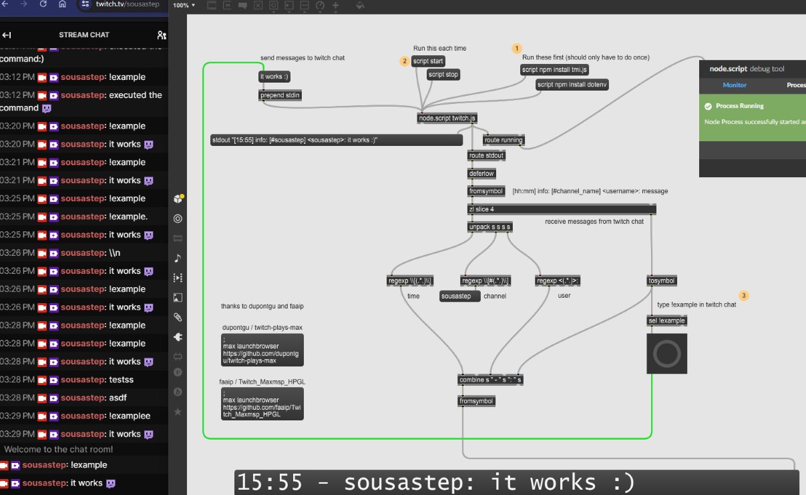

<div align="center">

[](https://makeapullrequest.com)

</div>

<a href="#studio_microphone-introduction"></a>

# :studio_microphone: Introduction

This simple Twitch bot can receive messages from, and send messages to, Twitch chat via Max.

<div align="center">



</div>

<a href="#floppy_disk-installation"></a>

# :floppy_disk: Installation

Download `Twitch_MaxMSP_Simple-Bot` to your Max projects folder,
and create a file named `.env` in `Twitch_MaxMSP_Simple-Bot/code`.
The .env file should contain the following:

```dotenv
BOT_USERNAME=username
CHANNEL_TO_JOIN=channelname
OAUTH_TOKEN=oauth:xxxxxxxxxxxxxxxxxxxxxxxxxxxxxx
```

> [!NOTE]
> I used this site to generate an oauth token: https://twitchapps.com/tmi/

<a href="#pray-credits"></a>

# :pray: Credits

Thanks to [dupontgu / twitch-plays-max](https://github.com/dupontgu/twitch-plays-max),
[faaip / Twitch_Maxmsp_HPGL](https://github.com/faaip/Twitch_Maxmsp_HPGL),
the Max documentation, and ChatGPT.
